# DevSecOps Portfolio

**Wissal Elkouk** - étudiante en master DevOps Cloud

Dans ce projet, j'ai fait évoluer mon mini CV en un petit portfolio DevSecOps en HTML5, CSS3 et JavaScript. Le code est versionné avec Git et publié sur GitHub, et le site est servi par Nginx dans un conteneur Docker.

## Capture d'écran de la nouvelle version

**1. En-tête et About**

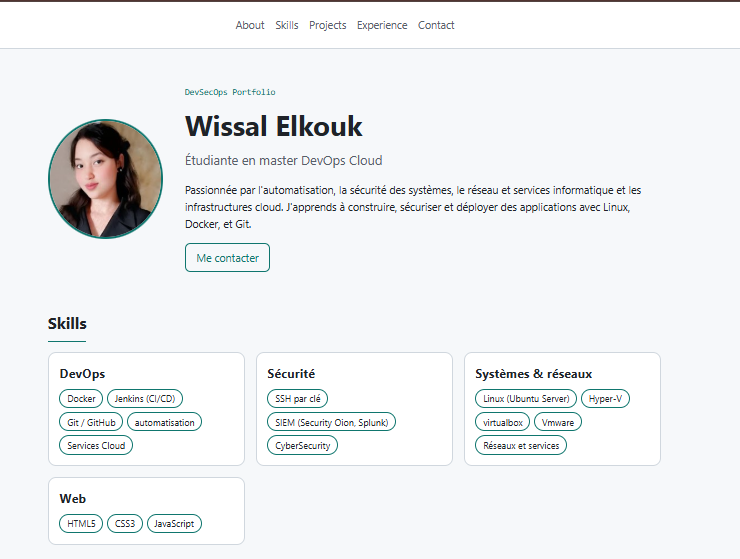

**2. Skills et Projects**

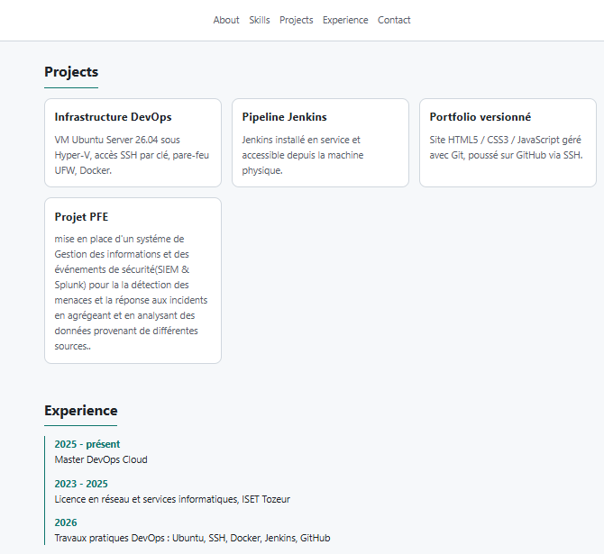

**3. Experience et Contact**

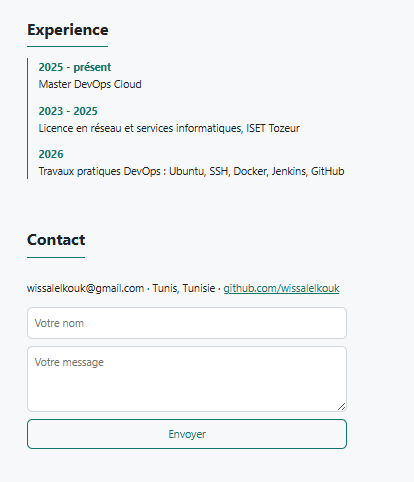

## Sections du portfolio

About, Skills, DevSecOps Skills, Projects, Experience, Contact.

## Principales améliorations

- Le CV d'une page est devenu un portfolio avec une barre de navigation et un défilement fluide vers chaque section.
- J'ai classé mes compétences par catégories : DevOps, Sécurité, Systèmes et réseaux, Web.
- Les projets sont présentés sous forme de cartes, et l'expérience sous forme de frise chronologique.
- J'ai ajouté un mode sombre et un mode clair, mémorisé dans le navigateur.
- Le site est responsive : il s'adapte aux écrans de téléphone.
- Le formulaire de contact ouvre le client mail, sans envoyer de données à un serveur.
- J'ai ajouté des protections de sécurité :
  - une politique `Content-Security-Policy` qui n'autorise que les scripts et styles du site ;
  - des liens externes avec `rel="noopener noreferrer"` ;
  - aucun mot de passe ni token dans le dépôt, avec un push par clé SSH.

## Étape 8 : section DevSecOps Skills

J'ai ajouté une section **DevSecOps Skills** qui affiche les technologies de la chaîne DevSecOps : Git, Docker, Jenkins, Kubernetes, Ansible, Terraform et Argo CD.

Chaque technologie est une carte avec une courte description. Un badge indique ce que j'ai **utilisé dans le projet** (Git, Docker, Jenkins), ce que je maîtrise déjà (**compétence acquise** : Kubernetes) et ce que je suis encore **en train d'apprendre** (Ansible, Terraform, Argo CD). J'ai aussi ajouté un lien « DevSecOps » dans le menu.

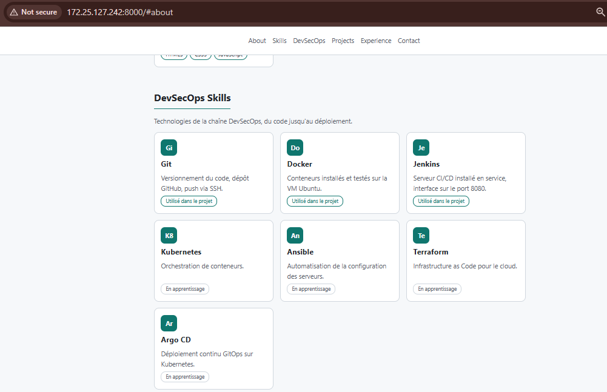

## Étape 9 : section Projects générée en JavaScript

Au lieu d'écrire mes projets à la main en HTML, je les ai mis dans un **tableau d'objets** en JavaScript. Une fonction crée une carte pour chaque objet et l'affiche dans la page. Pour ajouter un projet, il me suffit d'ajouter un objet au tableau.

Extrait de `script.js` :

```javascript
const projets = [
  {
    titre: "Serveur Jenkins",
    description: "Jenkins installé en service et accessible depuis la machine physique.",
    technologies: ["Jenkins", "Java", "CI/CD"],
  },
  {
    titre: "DevSecOps Portfolio",
    description: "Ce site : HTML5, CSS3 et JavaScript, versionné avec Git.",
    technologies: ["HTML5", "CSS3", "JavaScript", "Git"],
    lien: "https://github.com/wissalelkouk/mini-cv",
  },
];

function creerCarte(projet) {
  const carte = document.createElement("article");
  carte.className = "card projet";

  const titre = document.createElement("h3");
  titre.textContent = projet.titre;
  // ... la description, les technologies et le lien sont créés de la même façon

  carte.append(titre, description, tags);
  return carte;
}

const conteneurProjets = document.getElementById("projects-list");
projets.forEach((projet) => conteneurProjets.appendChild(creerCarte(projet)));
```

J'ai utilisé `createElement` et `textContent` plutôt que `innerHTML`, pour que le texte soit traité comme du texte et non comme du HTML (cela évite l'injection de code).

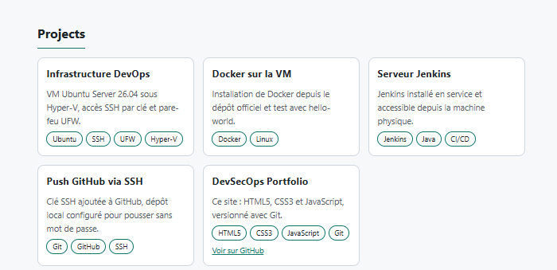

## Étape 10 : Dockerfile avec Nginx

J'ai créé un `Dockerfile` pour servir mon portfolio avec Nginx dans un conteneur.

```dockerfile
FROM nginx:alpine
COPY index.html style.css script.js photo.jpg /usr/share/nginx/html/
EXPOSE 80
```

**Explication :**

- `FROM nginx:alpine` : je pars de l'image officielle de Nginx basée sur Alpine Linux. Elle est très légère, ce qui réduit aussi la surface d'attaque.
- `COPY ...` : je copie seulement les fichiers du site dans le dossier que Nginx sert par défaut (`/usr/share/nginx/html/`). Les captures, le README et le dossier `.git` ne sont pas dans l'image, grâce au fichier `.dockerignore`.
- `EXPOSE 80` : le conteneur écoute sur le port 80.
- Je n'ai pas besoin de commande de démarrage, car l'image Nginx lance déjà le serveur.

**Construire et lancer le conteneur :**

```bash
docker build -t devsecops-portfolio .
docker run -d --name portfolio -p 8081:80 devsecops-portfolio
```

J'ai utilisé le port 8081 de la VM, car le port 8080 est déjà pris par Jenkins. Le site est accessible sur `http://IP_DE_LA_VM:8081`.

## Étape 11 : image Docker `cv-docker`

J'ai construit l'image Docker à partir du `Dockerfile` de l'étape 10, en la nommant `cv-docker`.

**Commande utilisée :**

```bash
docker build -t cv-docker .
```

- `docker build` construit une image à partir d'un Dockerfile.
- `-t cv-docker` donne le nom (le « tag ») `cv-docker` à l'image.
- Le point `.` indique que le Dockerfile et les fichiers du site sont dans le dossier courant.

Pour vérifier que l'image existe :

```bash
docker images cv-docker
```

**Capture d'écran du résultat :**

Construction de l'image : la ligne `naming to docker.io/library/cv-docker:latest` confirme que l'image s'appelle bien `cv-docker`.

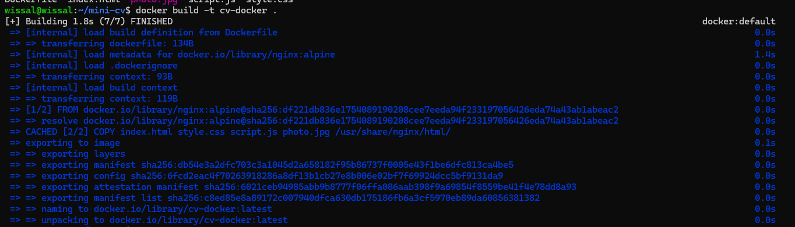

Vérification avec `docker images cv-docker` : l'image `cv-docker:latest` existe (environ 94 Mo sur le disque).

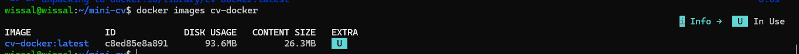

## Étape 12 : exécuter le conteneur et accéder au portfolio

J'ai lancé un conteneur à partir de l'image `cv-docker` en exposant le portfolio sur le port 8081 de la VM.

**Commande `docker run` :**

```bash
docker run -d --name cv-portfolio -p 8081:80 cv-docker
```

- `-d` : le conteneur tourne en arrière-plan.
- `--name cv-portfolio` : je donne un nom au conteneur.
- `-p 8081:80` : le port 8081 de la VM est relié au port 80 de Nginx dans le conteneur. J'ai pris le 8081 parce que le 8080 est déjà utilisé par Jenkins.
- `cv-docker` : l'image construite à l'étape 11.

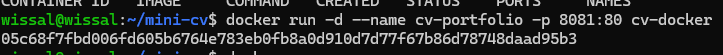

**Résultat de `docker ps` :**

```
CONTAINER ID   IMAGE       COMMAND                  CREATED         STATUS         PORTS                                     NAMES
05c68f7fbd00   cv-docker   "/docker-entrypoint.…"   9 seconds ago   Up 9 seconds   0.0.0.0:8081->80/tcp, [::]:8081->80/tcp   cv-portfolio
```

Le conteneur `cv-portfolio` est en marche (`Up`) et le port 8081 de la VM est relié au port 80 du conteneur.

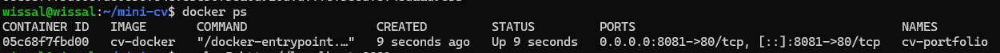

**Vérification depuis la machine physique :** dans le navigateur de Windows, j'ai ouvert `http://172.25.127.242:8081`. Le portfolio s'affiche, servi par Nginx depuis le conteneur.

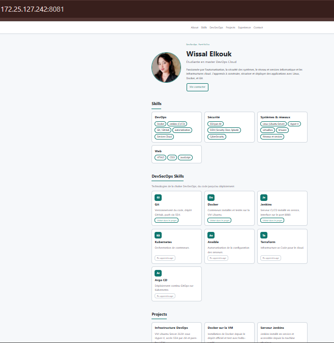

## Étape 13 : déploiement avec Docker Compose

J'ai déployé le portfolio avec Docker Compose. Au lieu de la longue commande `docker run`, les réglages sont écrits dans un fichier `docker-compose.yml`, et une seule commande lance tout.

**Fichier `docker-compose.yml` :**

```yaml
services:
  portfolio:
    build: .
    image: cv-docker
    container_name: cv-compose
    ports:
      - "8082:80"
    restart: unless-stopped
```

- `build: .` et `image: cv-docker` : le service utilise l'image `cv-docker` (construite à partir du Dockerfile si elle n'existe pas).
- `container_name: cv-compose` : le nom du conteneur.
- `ports: "8082:80"` : le port 8082 de la VM est relié au port 80 de Nginx. J'ai pris le 8082 parce que le 8081 est déjà utilisé par le conteneur de l'étape 12.
- `restart: unless-stopped` : le conteneur redémarre tout seul avec la VM.

**Commande utilisée :**

```bash
docker compose up -d
```

`up` crée et démarre les conteneurs décrits dans le fichier, et `-d` les lance en arrière-plan.

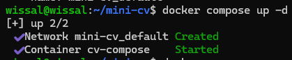

**Résultat de `docker compose ps` :**

```
NAME         IMAGE       COMMAND                  SERVICE     CREATED          STATUS          PORTS
cv-compose   cv-docker   "/docker-entrypoint.…"   portfolio   15 seconds ago   Up 14 seconds   0.0.0.0:8082->80/tcp, [::]:8082->80/tcp
```

Le service `portfolio` tourne dans le conteneur `cv-compose` (statut `Up`), et le port 8082 de la VM est relié au port 80.

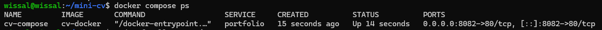

**Capture d'écran :** le portfolio est accessible depuis la machine physique à l'adresse `http://172.25.127.242:8082`.

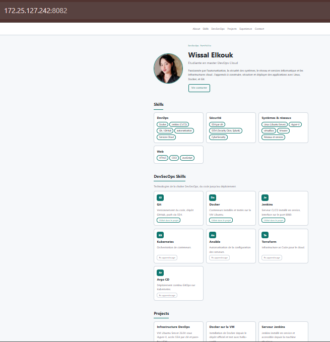

## Lancer le site sans Docker

```bash
python3 -m http.server 8000
```

Puis j'ouvre `http://IP_DE_LA_VM:8000` dans le navigateur.

## Commandes Git utilisées

```bash
git add .
git commit -m "Message du commit"
git push
```
