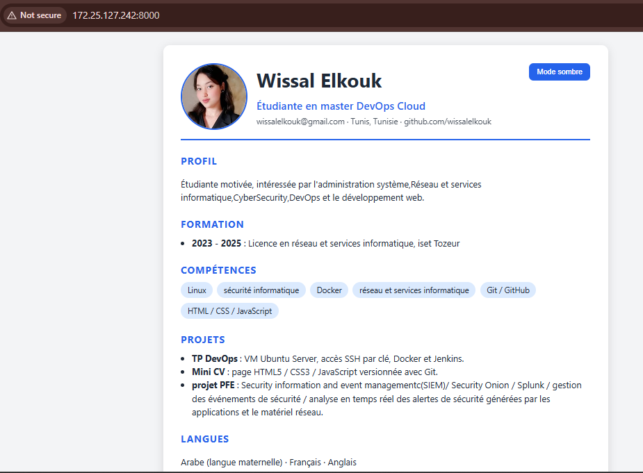

# Mini CV

CV One Page en HTML5, CSS3 et JavaScript, versionné avec Git.

## Fichiers
- `index.html` : structure
- `style.css` : mise en forme et photo
- `script.js` : bouton mode sombre / clair
- `photo.jpg` : photo de profil

## Lancer le CV
```bash
python3 -m http.server 8000
```
Puis ouvrir `http://IP_DE_LA_VM:8000`.

## Capture d'écran


