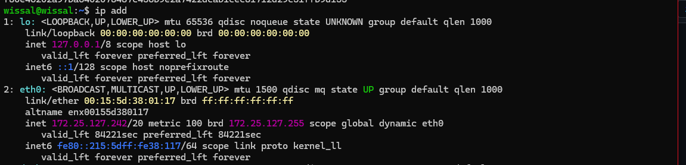
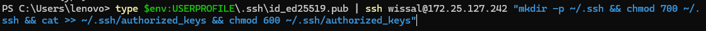
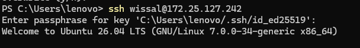
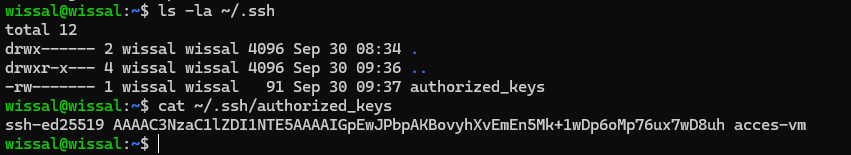

# TP - Accès SSH à la VM Ubuntu Server

**Nom :** Wissal
**Machine virtuelle :** Ubuntu Server 26.04 sous Hyper-V
**Machine physique :** Windows

## Objectif

Tester l'accès SSH à la VM depuis ma machine physique, et configurer une connexion sécurisée avec une clé SSH.

## Étape 1 : trouver l'adresse IP de la VM

Dans la VM, j'ai tapé :

```bash
ip a
```

Résultat (extrait) :

```
2: eth0: <BROADCAST,MULTICAST,UP,LOWER_UP> mtu 1500 qdisc mq state UP group default qlen 1000
    link/ether 00:15:5d:38:01:17 brd ff:ff:ff:ff:ff:ff
    inet 172.25.127.242/20 metric 100 brd 172.25.127.255 scope global dynamic eth0
    inet6 fe80::215:5dff:fe38:117/64 scope link proto kernel_ll
```

L'adresse IP de la VM est `172.25.127.242` (interface `eth0`).



## Étape 2 : première connexion avec mot de passe

Depuis PowerShell sur Windows :

```powershell
ssh wissal@172.25.127.242
```

Résultat :

```
The authenticity of host '172.25.127.242 (172.25.127.242)' can't be established.
ED25519 key fingerprint is SHA256:OAcjXg5Gt/ZorLwVYZS/n6C2rDlNqwJJGXQUPyxCICI.
Are you sure you want to continue connecting (yes/no/[fingerprint])? yes
Warning: Permanently added '172.25.127.242' (ED25519) to the list of known hosts.
wissal@172.25.127.242's password:
```

J'ai répondu `yes` pour accepter l'empreinte du serveur, puis j'ai tapé le mot de passe de l'utilisateur.

## Étape 3 : créer une clé SSH

Toujours sur Windows :

```powershell
ssh-keygen -t ed25519 -C "acces-vm"
```

Résultat :

```
Generating public/private ed25519 key pair.
Enter file in which to save the key (C:\Users\lenovo/.ssh/id_ed25519):
Enter passphrase (empty for no passphrase):
Enter same passphrase again:
Your identification has been saved in C:\Users\lenovo/.ssh/id_ed25519
Your public key has been saved in C:\Users\lenovo/.ssh/id_ed25519.pub
The key fingerprint is:
SHA256:8JD2SfoMrfZoEaoxPuhfDaVc1IIJSmVWMTCMn2LIps4 acces-vm
```

Cette commande crée deux fichiers dans `C:\Users\lenovo\.ssh\` :
- `id_ed25519` : la clé privée (elle reste sur mon PC)
- `id_ed25519.pub` : la clé publique (elle sera copiée sur la VM)

## Étape 4 : copier la clé publique sur la VM

```powershell
type $env:USERPROFILE\.ssh\id_ed25519.pub | ssh wissal@172.25.127.242 "mkdir -p ~/.ssh && chmod 700 ~/.ssh && cat >> ~/.ssh/authorized_keys && chmod 600 ~/.ssh/authorized_keys"
```

Résultat : la commande demande le mot de passe de `wissal`, puis se termine sans message. C'est normal, cela veut dire qu'il n'y a pas d'erreur.

```
wissal@172.25.127.242's password:
PS C:\Users\lenovo>
```

Cette commande ajoute ma clé publique dans le fichier `authorized_keys` de la VM.



## Étape 5 : tester la connexion avec la clé

```powershell
ssh wissal@172.25.127.242
```

Résultat :

```
Enter passphrase for key 'C:\Users\lenovo/.ssh/id_ed25519':
Welcome to Ubuntu 26.04 LTS (GNU/Linux 7.0.0-34-generic x86_64)

  System load:  0.37              Processes:             123
  Usage of /:   9.3% of 60.70GB   Users logged in:       0
  Memory usage: 10%               IPv4 address for eth0: 172.25.127.242

wissal@wissal:~$
```

La connexion fonctionne : SSH ne demande plus le mot de passe de l'utilisateur, seulement la passphrase de la clé.



## Vérification dans la VM

J'ai vérifié que la clé est bien enregistrée :

```bash
ls -la ~/.ssh
cat ~/.ssh/authorized_keys
```

Résultat :

```
total 12
drwx------ 2 wissal wissal 4096 Sep 30 08:34 .
drwxr-x--- 4 wissal wissal 4096 Sep 30 09:36 ..
-rw------- 1 wissal wissal   91 Sep 30 09:37 authorized_keys

ssh-ed25519 AAAAC3NzaC1lZDI1NTE5AAAAIGpEwJPbpAKBovyhXvEmEn5Mk+1wDp6oMp76ux7wD8uh acces-vm
```

Les droits sont corrects (`700` pour `.ssh`, `600` pour `authorized_keys`) et la clé est bien présente.



## Pare-feu

Pour que SSH ne soit pas bloqué, j'ai autorisé OpenSSH dans le pare-feu :

```bash
sudo ufw allow OpenSSH
sudo ufw enable
sudo ufw status
```

Résultat :

```
Command may disrupt existing ssh connections. Proceed with operation (y|n)? y
Firewall is active and enabled on system startup

Status: active

To                         Action      From
--                         ------      ----
OpenSSH                    ALLOW       Anywhere
OpenSSH (v6)               ALLOW       Anywhere (v6)
```

## Problèmes rencontrés

- **`Permission denied`** : j'avais utilisé `ubuntuserver` comme identifiant, mais c'était le nom de la machine. Le bon utilisateur est `wissal` (vérifié avec `whoami`).
- **Le mot de passe était demandé malgré la clé** : je m'étais trompée dans la passphrase. Le test `ssh-keygen -y -f $env:USERPROFILE\.ssh\id_ed25519` a affiché `incorrect passphrase supplied to decrypt private key`.
- **L'adresse IP a changé** après un redémarrage de la VM. J'ai retrouvé la nouvelle avec `ip a`.
- **Avertissement `REMOTE HOST IDENTIFICATION HAS CHANGED`** : j'ai supprimé l'ancienne empreinte avec `ssh-keygen -R ADRESSE_IP` sur Windows.

## Conclusion

L'accès SSH fonctionne depuis ma machine physique vers la VM, avec une clé SSH. C'est plus sûr qu'un simple mot de passe.
