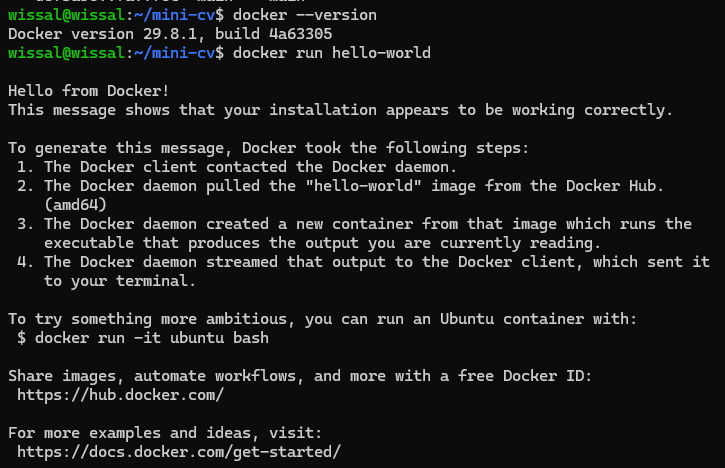

# TP - Installation de Docker sur la VM

**Nom :** Wissal Elkouk
**Machine virtuelle :** Ubuntu Server 26.04 sous Hyper-V (4 Go de RAM fixe)
**Machine physique :** Windows

## Objectif

Installer Docker sur la VM et vérifier son fonctionnement.

Toutes les commandes se lancent dans la VM, en SSH :

```powershell
ssh wissal@172.25.127.242
```

## Étape 1 : mettre à jour le système et installer les prérequis

```bash
sudo apt update && sudo apt upgrade -y
sudo apt install -y ca-certificates curl
```

## Étape 2 : ajouter la clé GPG officielle de Docker

```bash
sudo install -m 0755 -d /etc/apt/keyrings
sudo curl -fsSL https://download.docker.com/linux/ubuntu/gpg -o /etc/apt/keyrings/docker.asc
sudo chmod a+r /etc/apt/keyrings/docker.asc
```

## Étape 3 : ajouter le dépôt Docker

```bash
sudo tee /etc/apt/sources.list.d/docker.sources <<EOT
Types: deb
URIs: https://download.docker.com/linux/ubuntu
Suites: $(. /etc/os-release && echo "${UBUNTU_CODENAME:-$VERSION_CODENAME}")
Components: stable
Signed-By: /etc/apt/keyrings/docker.asc
EOT
```

Sur Ubuntu 26.04, la suite utilisée est `resolute`.

## Étape 4 : installer Docker

```bash
sudo apt update
sudo apt install -y docker-ce docker-ce-cli containerd.io docker-buildx-plugin docker-compose-plugin
```

Résultat (extrait) :

```
Installation de :
  containerd.io  docker-buildx-plugin  docker-ce  docker-ce-cli  docker-compose-plugin

101 Mo réceptionnés en 3min 55s (428 ko/s)
Paramétrage de containerd.io (2.3.6-1~ubuntu.26.04~resolute) ...
Paramétrage de docker-ce (5:29.8.1-1~ubuntu.26.04~resolute) ...
Created symlink '/etc/systemd/system/multi-user.target.wants/docker.service' → '/usr/lib/systemd/system/docker.service'.
Created symlink '/etc/systemd/system/sockets.target.wants/docker.socket' → '/usr/lib/systemd/system/docker.socket'.
```

Les 7 paquets sont installés (Docker Engine 29.8.1, Compose 5.5.1, Buildx 0.37.1).

## Étape 5 : activer le service et utiliser Docker sans `sudo`

```bash
sudo systemctl enable --now docker
sudo usermod -aG docker $USER
newgrp docker
```

## Étape 6 : vérifier l'installation

```bash
docker --version
docker run hello-world
```

Résultat de `docker --version` :

```
Docker version 29.8.1, build 4a63305
```

Résultat de `docker run hello-world` :

```
Hello from Docker!
This message shows that your installation appears to be working correctly.

To generate this message, Docker took the following steps:
 1. The Docker client contacted the Docker daemon.
 2. The Docker daemon pulled the "hello-world" image from the Docker Hub.
    (amd64)
 3. The Docker daemon created a new container from that image which runs the
    executable that produces the output you are currently reading.
 4. The Docker daemon streamed that output to the Docker client, which sent it
    to your terminal.
```

Le message `Hello from Docker!` confirme que Docker fonctionne : le client a contacté le démon, téléchargé l'image et lancé un conteneur.



## Problèmes rencontrés

- **`Killed` pendant `apt install`** : cause : mémoire dynamique d'Hyper-V (`Out of memory: Killed process ... (apt)` dans `sudo dmesg`). Solution : VM éteinte, mémoire dynamique désactivée et RAM fixée à 4 Go avec `Set-VMMemory -VMName "NOM" -DynamicMemoryEnabled $false -StartupBytes 4GB`.
- **L'installateur d'Ubuntu se relançait** : l'ISO était restée montée. Solution : lecteur de DVD sur **Aucun** dans Hyper-V.

## Conclusion

Docker est installé sur la VM, le service démarre automatiquement, et le conteneur `hello-world` s'exécute correctement.
