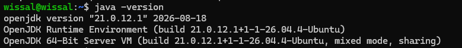
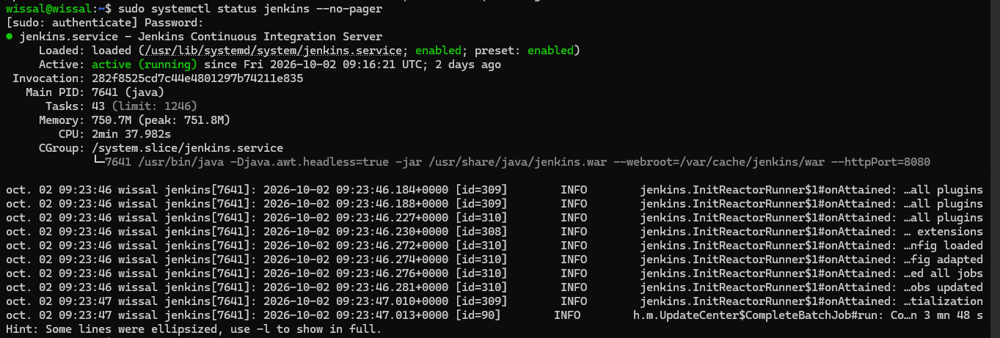
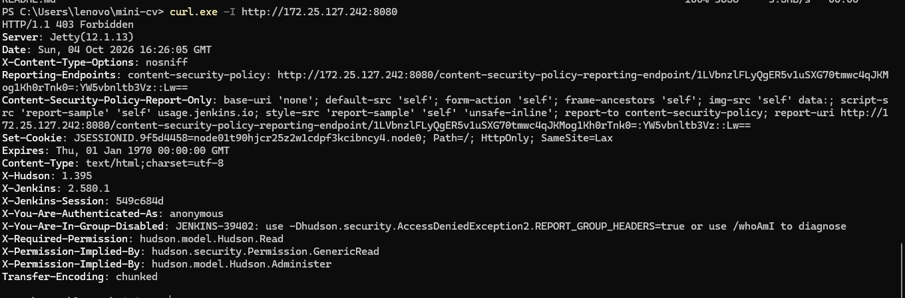
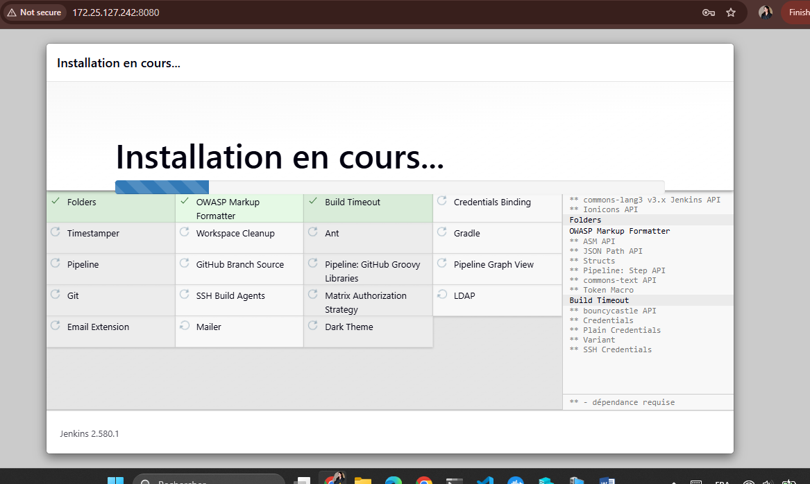
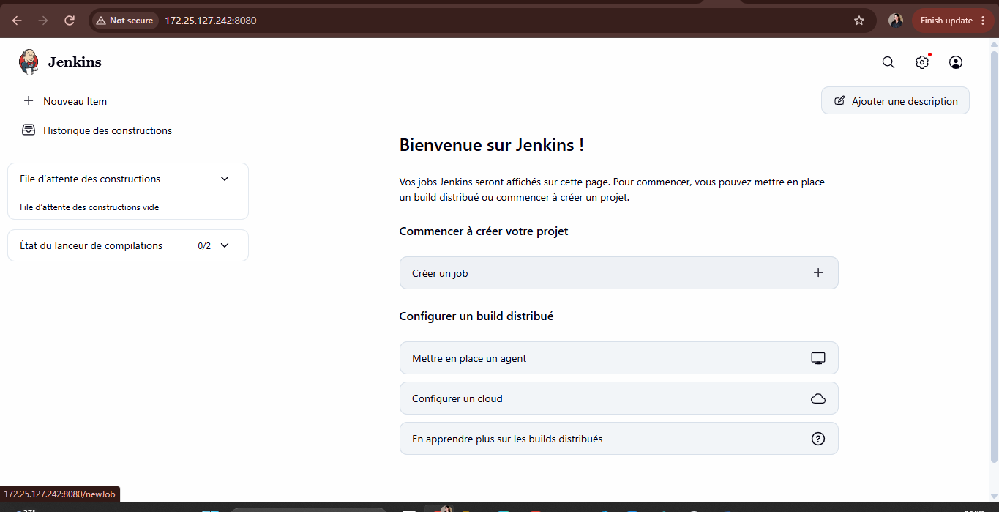

# TP - Installation de Jenkins en tant que service

**Nom :** Wissal Elkouk
**Machine virtuelle :** Ubuntu Server 26.04 sous Hyper-V (4 Go de RAM fixe)
**Machine physique :** Windows
**Adresse de la VM :** 172.25.127.242

## Objectif

Installer Jenkins sur la VM en tant que service, et vérifier son bon fonctionnement depuis la machine physique.

Toutes les commandes se lancent dans la VM, en SSH, sauf `curl.exe` et le navigateur, qui sont sur Windows.

## Étape 1 : vérifier la mémoire

```bash
free -h
```

Jenkins consomme de la mémoire. Avec la mémoire dynamique d'Hyper-V, l'installation était interrompue (`Killed`), donc la RAM de la VM a été fixée à 4 Go.

## Étape 2 : installer Java

Jenkins est écrit en Java, il faut donc l'installer en premier.

```bash
sudo apt update
sudo apt install -y fontconfig openjdk-21-jre
java -version
```

Résultat de `java -version` :

```
openjdk version "21.0.12.1" 2026-08-18
OpenJDK Runtime Environment (build 21.0.12.1+1-1-26.04.4-Ubuntu)
OpenJDK 64-Bit Server VM (build 21.0.12.1+1-1-26.04.4-Ubuntu, mixed mode, sharing)
```



## Étape 3 : ajouter le dépôt officiel de Jenkins

```bash
sudo wget -O /etc/apt/keyrings/jenkins-keyring.asc \
  https://pkg.jenkins.io/debian-stable/jenkins.io-2026.key

echo "deb [signed-by=/etc/apt/keyrings/jenkins-keyring.asc]" \
  https://pkg.jenkins.io/debian-stable binary/ | sudo tee \
  /etc/apt/sources.list.d/jenkins.list > /dev/null
```

La première commande télécharge la clé de signature du dépôt, la seconde ajoute le dépôt Jenkins (version LTS) aux sources `apt`.

## Étape 4 : installer Jenkins et le démarrer en tant que service

```bash
sudo apt update
sudo apt install -y jenkins
sudo systemctl enable --now jenkins
sudo systemctl status jenkins --no-pager
```

`enable` lance Jenkins au démarrage de la VM, et `--now` le démarre tout de suite.

Résultat de `systemctl status` (extrait) :

```
● jenkins.service - Jenkins Continuous Integration Server
     Loaded: loaded (/usr/lib/systemd/system/jenkins.service; enabled; preset: enabled)
     Active: active (running) since Fri 2026-10-02 09:16:21 UTC; 2 days ago
   Main PID: 7641 (java)
     Memory: 750.7M (peak: 751.8M)
     CGroup: /system.slice/jenkins.service
             └─7641 /usr/bin/java -Djava.awt.headless=true -jar /usr/share/java/jenkins.war --webroot=/var/cache/jenkins/war --httpPort=8080
```

Le service est `enabled` (démarrage automatique) et `active (running)`. Jenkins écoute sur le port 8080.



## Étape 5 : ouvrir le port 8080 dans le pare-feu

Jenkins écoute sur le port 8080. Le pare-feu (UFW) autorisait seulement SSH.

```bash
sudo ufw allow 8080/tcp
sudo ufw status
```

## Étape 6 : récupérer le mot de passe initial

```bash
sudo cat /var/lib/jenkins/secrets/initialAdminPassword
```

Ce mot de passe sert à débloquer Jenkins à la première connexion. Il n'est pas reproduit ici, car il donne accès à Jenkins.

## Étape 7 : vérifier depuis la machine physique

**Test en ligne de commande**, depuis PowerShell sur Windows :

```powershell
curl.exe -I http://172.25.127.242:8080
```

Résultat (extrait) :

```
HTTP/1.1 403 Forbidden
Server: Jetty(12.1.13)
X-Jenkins: 2.580.1
X-You-Are-Authenticated-As: anonymous
```

Jenkins répond à la machine physique (serveur Jetty, Jenkins 2.580.1). Le code `403` est normal : la requête est anonyme et Jenkins demande une authentification.



**Test dans le navigateur**, sur Windows : `http://172.25.127.242:8080`

1. Coller le mot de passe initial dans la page **Unlock Jenkins**.
2. Choisir **Install suggested plugins**.



3. Créer le compte administrateur.
4. Valider l'URL de Jenkins, puis **Start using Jenkins**.

Le tableau de bord de Jenkins s'affiche dans le navigateur de la machine physique : Jenkins fonctionne.



## Problèmes rencontrés

- **`Killed` pendant l'installation** : cause : mémoire dynamique d'Hyper-V (`Out of memory` dans `dmesg`). Solution : VM éteinte, mémoire dynamique désactivée et RAM fixée à 4 Go.
- **`404 Not Found` sur le paquet `alsa-ucm-conf`** pendant l'installation de Java : la liste des paquets était périmée par rapport au miroir Ubuntu. Solution : `sudo apt update`, puis relancer l'installation.
- **Le navigateur n'atteignait pas le port 8080** : il fallait ouvrir le port avec `sudo ufw allow 8080/tcp`.
- **L'adresse IP de la VM change après un redémarrage** (DHCP du *Default Switch*) : elle se retrouve avec `ip a`.

## Conclusion

Jenkins est installé en tant que service sur la VM, démarre automatiquement, et son interface web est accessible depuis la machine physique.
