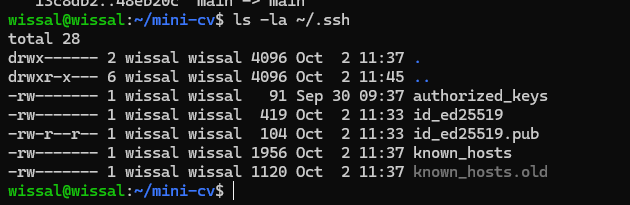
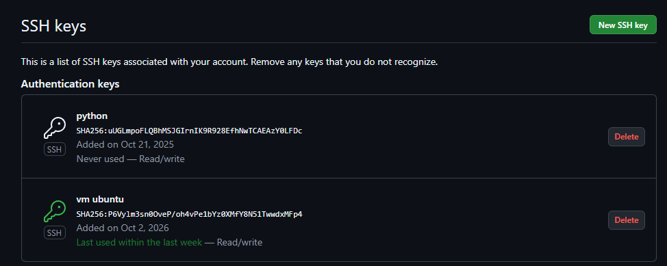
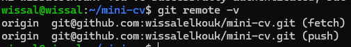
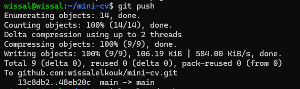

# TP - Activer les push GitHub via SSH

**Nom :** Wissal Elkouk
**Machine :** VM Ubuntu Server 26.04 (Hyper-V)
**Dépôt :** https://github.com/wissalelkouk/mini-cv

## Objectif

Envoyer le code du dépôt `mini-cv` vers GitHub avec une clé SSH, sans saisir de mot de passe ni de token.

Toutes les commandes sont lancées dans la VM.

## Étape 1 : générer une clé SSH pour GitHub

```bash
ssh-keygen -t ed25519 -C "wissalelkouk@gmail.com"
ls -la ~/.ssh
```

Résultat de `ls -la ~/.ssh` :

```
total 28
drwx------ 2 wissal wissal 4096 Oct  2 11:37 .
drwxr-x--- 6 wissal wissal 4096 Oct  2 11:45 ..
-rw------- 1 wissal wissal   91 Sep 30 09:37 authorized_keys
-rw------- 1 wissal wissal  419 Oct  2 11:33 id_ed25519
-rw-r--r-- 1 wissal wissal  104 Oct  2 11:33 id_ed25519.pub
-rw------- 1 wissal wissal 1956 Oct  2 11:37 known_hosts
-rw------- 1 wissal wissal 1120 Oct  2 11:37 known_hosts.old
```

La paire de clés est créée : `id_ed25519` (clé **privée**, droits `600`, elle reste dans la VM) et `id_ed25519.pub` (clé **publique**, à copier sur GitHub).



## Étape 2 : afficher la clé publique

```bash
cat ~/.ssh/id_ed25519.pub
```

La ligne affichée (elle commence par `ssh-ed25519` et se termine par l'e-mail) est copiée en entier. Seule la clé publique est copiée, jamais la clé privée.


## Étape 3 : ajouter la clé sur GitHub

1. GitHub, **Settings**
2. **SSH and GPG keys**
3. **New SSH key**
4. **Title** : `VM Ubuntu`
5. **Key** : coller la clé publique
6. **Add SSH key**

La clé `vm ubuntu` apparaît dans la liste, avec le statut « Last used » une fois utilisée pour le push.



## Étape 4 : tester la connexion

```bash
ssh -T git@github.com
```

Résultat :

```
Hi wissalelkouk! You've successfully authenticated, but GitHub does not provide shell access.
```

GitHub reconnaît la clé de la VM. Le message est normal : GitHub ne donne pas d'accès shell.


## Étape 5 : configurer le dépôt local pour utiliser SSH

```bash
cd ~/mini-cv
git remote set-url origin git@github.com:wissalelkouk/mini-cv.git
git remote -v
```

Résultat :

```
origin  git@github.com:wissalelkouk/mini-cv.git (fetch)
origin  git@github.com:wissalelkouk/mini-cv.git (push)
```

L'adresse passe de `https://github.com/...` à `git@github.com:...`.



## Étape 6 : push par SSH

```bash
git push
```

Résultat :

```
Enumerating objects: 14, done.
Counting objects: 100% (14/14), done.
Delta compression using up to 2 threads
Compressing objects: 100% (9/9), done.
Writing objects: 100% (9/9), 106.19 KiB | 584.00 KiB/s, done.
Total 9 (delta 0), reused 0 (delta 0), pack-reused 0 (from 0)
To github.com:wissalelkouk/mini-cv.git
   13c8db2..48eb20c  main -> main
```

Le push réussit sans demande d'identifiant ni de token.



## Problèmes rencontrés

- **Authentification HTTPS refusée** : j'avais saisi mon e-mail à la place du nom d'utilisateur GitHub, et GitHub n'accepte plus le mot de passe du compte pour Git. J'ai utilisé un token d'accès personnel pour le premier push, puis je suis passée à SSH.
- **Nettoyage** : le token et le fichier `~/.git-credentials` ont été supprimés une fois SSH en place (`rm -f ~/.git-credentials` et `git config --global --unset credential.helper`).

## Conclusion

Les push vers GitHub se font maintenant avec la clé SSH de la VM, sans mot de passe ni token.
